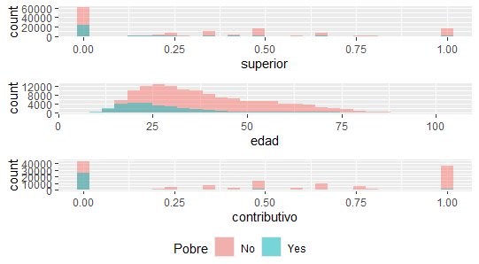
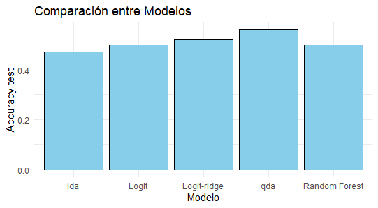

```{r setup, include=FALSE}
knitr::opts_chunk$set(echo = TRUE, fig.pos = 'H')
```


# Introducción

# Datos (al final)

## Procesamiento de Datos

### Consolidación de base "clean"

### Construcción de variables (feature engineering)

### Ejercicio con variables DANE


## Análisis Descriptivo


# Modelos y resultados

## Modelos de Clasificación

## Modelos de Predicción de Ingreso

## Modelos Finales (QDA) 

Para el modelo de clasificación, se estimó la siguiente especificación: 

$$
\small Pobre= edad + edad^2 + mujer + estud+ trab + 
ofi + prim + secun+ media +super+cuartos+contri+ adul+rur+arr
$$
La siguiente tabla presenta la descripción de cada una de estas variables: edad(debido a la relación de u invertida entre el ingreso y la edad), genero (existe evidencia de que las mujeres tienen menor ingresos que los hombres), variables que identifican la ocupación (un hogar con mayor cantidad de personas que estudian, buscan trabajo o se dedican a los oficios del hogar por lo general tendrán menores ingresos), variables que identifican la educación (existe una correlación entre educación e ingresos), número de cuartos en la vivienda(un hogar con mayor cantidad de cuartos es más probable que no sea pobre), porcentaje de personas que están en el régimen contributivo(una familia con régimen contributivo implica que tienen mayores ingresos o empleo formal), número de adultos(los hogares con mayor cantidad de adultos implica que está conformado con personas con capacidad de trabajar), si la vivienda es rural(existe evidencia de que las personas que viven en zona rural tienen menos ingreso) y  si la vivienda es arrendada (las personas que viven en arriendo pueden tener menos ingresos que personas que tienen casa propia).


|     Predictor            |     Descripción                                                                                                                                      |
|--------------------------|------------------------------------------------------------------------------------------------------------------------------------------------------|
|     Edad                 |     Edad promedio de las   personas dentro de un hogar.                                                                                              |
|     Edad_2               |     El cuadrado de la   variable edad.                                                                                                               |
|    estud          |     Número de personas   dentro del hogar que se dedicaron mayor parte del tiempo a estudiar.                                                        |
|     mujer              |     Proporción de   personas dentro del hogar que son mujeres.                                                                                       |
|   trab        |     Número de personas dentro   del hogar que se dedicaron mayor parte del tiempo a buscar trabajo.                                                  |
| ofi          |     Número de personas dentro   del hogar que se dedicaron mayor parte del tiempo a oficios del hogar.                                               |
|   prim         |     Número de personas dentro   del hogar con educación primaria como mayor nivel educativo.                                                         |
|     secun         |     Número de personas dentro   del hogar con educación secundaria como mayor nivel educativo.                                                       |
|   media                |     Número de personas   dentro del hogar con educación media como mayor nivel educativo.                                                            |
|     super            |     Número de personas   dentro del hogar con educación superior(Técnico o tecnológico, Universitario   o Postgrado) como mayor nivel educativo.     |
|   cuartos          |     Número de cuartos   dentro del hogar.                                                                                                            |
|     adul          |     Número de adultos   dentro del hogar.                                                                                                            |
|     rur               |     =1 si el hogar está   en la zona rural y 0 si está ubicado en la zona urbana.                                                                    |
|     arri    |     =1 si la vivienda ocupada   por el hogar es en arriendo o subarriendo                                                                            |
|     contri        |     Promedio de personas dentro   del hogar que están afiliados al régimen contributivo de seguridad social en   salud.                              |


Para el enfoque de clasificación, se realizaron cinco estimaciones: Logit, QDA, LDA, logit-ridge  y random Forest. Todas las estimaciones de estas metodologías se realizaron con las mismas variables. Para todos los modelos, escogimos los hiperparámetros usando cross validación. Este proceso consiste en dividir los datos en k subconjuntos y entrenarlos k veces, utilizando un subconjunto de prueba y los restantes de entrenamiento en cada entrenamiento. En el caso de los modelos que se estimaron en este proyecto, se realizó 5 folds o particiones en las que se dividieron los datos en la validación cruzada. Se realizó este proceso debido a que permite evaluar el rendimiento de los modelos de forma más robusta, ya que permite evaluar las predicciones y garantizar que son independientes de la partición entre datos de entramiento y prueba. Con esto, se garantiza que no existan problemas de sobreajuste(por ejemplo, que tenga una precisión de 1 en el conjunto train, pero que tenga una precisión muy baja en el conjunto de datos fuera de la muestra). 

Al momento de realizar las predicciones, el modelo con mejor Accuracy en el test set fue el Análisis Discriminante Cuadrático (QDA). Este es un algoritmo de clasificación supervisada se utiliza para separar las clases diferentes basadas en características observadas. Este algoritmo asume que cada observación de cada clase tiene su propia distribución gaussiana  y resulta de introducir estimaciones de los parámetros en el teorema de Bayes para realizar la predicción. Además,  supone que cada clase tiene su propia matriz de covarianza.

En la siguiente tabla  se puede observar la tabla con la correlación entre la variable pobre(transformada en dicotómica) y las demás variables. Se puede apreciar que las variables que más contribuyen a la predicción son la edad promedio del hogar, el porcentaje de personas que están en el régimen contributivo y el número de personas del hogar con educación superior, debido a que tienen una correlación alta con la variable que clasifica a la población en dos grupos. Podemos observar también, en la gráfica x,   la distribución de estas variables según la clase a la que pertenece(pobre o no pobre). Este gráfico muestra que estas mismas variables son las que tienen distribuciones que menos se solapan entre los grupos.  

| variable     | correlación    |
|--------------|----------------|
| edad         | -0.20          |
| edad         | -0.15          |
| mujer        | 0.04           |
| estud        | 0.09           |
| trab         | 0.08           |
| ofi          | 0.09           |
| prim         | 0.14           |
| secun        | 0.09           |
| media        | -0.06          |
| super        | -0.25          |
| cuartos      | -0.14          |
| contri       | -0.37          |
| adul         | -0.04          |
| rur          | -0.08          |
| arr          | 0.05           |

```{r include, echo=FALSE, fig.cap="Distribución de las variables más importantes entre grupos",fig.align='center', fig.pos='H'}


```

Las métricas que se utilizaron para seleccionar el mejor modelo fue la exactitud (Accuracy) en los datos de test. Esta métrica consiste en el cociente entre los valores verdaderos predichos correctamente más los valores falsos predichos correctamente sobre el total de las observaciones ((TP+TN)/(P+N)). Este valor en resumen mide la cantidad de aciertos que tuvimos al predecir los si una persona era pobre o no.


En la gráfica x se puede observar la exactitud en la base test para cada uno de los modelos que se estimaron. El modelo con mejor rendimiento fue el qda(con un accuracy de 0.56), seguido por el Logit-ridge(0.52). Los demás modelos, tuvieron rendimientos iguales o menores a 0.5 (random forest y logit del 0.5 y lda de 0.47). Una posible explicación a que el modelo QDA sea más preciso que el logit, el lda y el logit-ridge es porque el QDA es más flexible en términos de asumir diferentes matrices de covarianza para cada clase, lo que brinda una mayor capacidad de ajuste y permite adapatarse mejor al conjunto de datos. En cuanto al por qué el QDA tiene un mejor rendimiento que el random forest puede ser explicado porque al utilizar 15 variables, el modelo se estaría sobreajustando a los datos de entrenamiento, por lo que la predicción fuera de la muestra es baja. 

```{r include_image, echo=FALSE, fig.cap="Comparación precisión de los modelos",fig.align='center', fig.pos='H'}


```


# Conclusiones

# Referencias bibliográficas

::: {#refs}
:::
