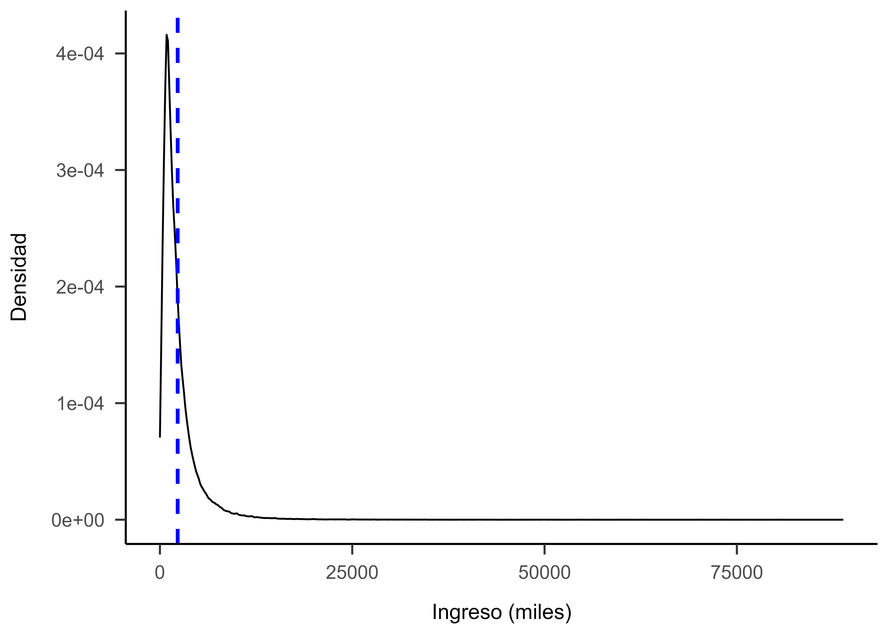

```{r setup, include=FALSE}
knitr::opts_chunk$set(echo = TRUE, fig.pos = 'H')
```


# Introducción

La lucha contra la pobreza ha sido un tema central en la agenda global durante décadas, debido a que afecta a millones de personas en el mundo. En este sentido organismos como el Banco Mundial han desempeñado un papel importante en la recopilación de datos y generación de análisis que ayudan a comprender la magnitud y las tendencias de la pobreza a nivel mundial. Sin embargo, este esfuerzo enfrenta desafíos especiales en países o regiones con limitaciones de datos, recursos, crisis y cambios constantes. 

En este contexto, la predicción de la pobreza se vuelve fundamental para analizar como fenómenos como la pandemia de COVID-19 pueden estar afectando este aspecto, especialmente la pobreza extrema en diversas regiones [@yonzan]. Se ha observado un avance en la generación de predicciones de la pobreza por parte de entidades como el Banco Mundial [@wb], así como otras instituciones nacionales e internacionales, con el propósito de proporcionar información relevante para la formulación de políticas públicas.

En Colombia, también se han realizado avances en la medición de la pobreza a través de organismos como el DANE y universidades. No obstante, continúa siendo un desafío importante, complejo y costoso que requiere cierto tiempo. Por lo tanto, la predicción de la pobreza mediante modelos de aprendizaje automático puede resultar eficiente y accesible para los territorios, ofreciendo una oportunidad para agilizar y mejorar la evaluación de la pobreza. Esto permitiría una mayor focalización de recursos y políticas, siendo aún más efectivo al incorporar datos específicos de cada territorio, como conflictos armados, condiciones de vida, estructura y actividad productiva.

En este contexto, como una alternativa a las limitaciones de recursos económicos y de tiempo, este estudio propone desarrollar un modelo de clasificación y predicción de la pobreza a nivel de hogares en Colombia, usando datos del Departamento Administrativo Nacional de Estadística - DANE y la Misión para el Empalme de las Series de Empleo, Pobreza y Desigualdad - MESE) del año 2018, que incluyen información a nivel de individuo y hogar. Estos datos se dividen en dos bloques: una base de entrenamiento y una base de prueba, ambas a nivel de persona y hogar. La diferencia entre estas bases radica en que la de entrenamiento contiene todas las variables necesarias para el cálculo de la pobreza, lo que sirve como conjunto de entrenamiento para nuestra predicción, mientras que la de prueba carece de variables como ingresos, necesarias para este cálculo.

Ahora, dado que estas bases contienen más de 200 variables, uno de los primeros pasos fue seleccionar las más relevantes para nuestro propósito. En este sentido, se optó por seleccionar XXX variables, teniendo en cuenta el esfuerzo y la capacidad computacional requerida para ejecutar modelos con una gran cantidad de variables y observaciones. Estas variables, seleccionadas a partir de una revisión de literatura, incluyen características socioeconómicas como edad, género, nivel educativo y tipo de vivienda, entre otras.
Después de plantear y probar varios modelos de regresión y clasificación de pobreza, como Logit, Bagging, Boosting, Random-Forest, Logit-Carret, QDA e IDA, se determinó que el modelo con mejores resultados era el QDA, con una precisión del 0.56. Es importante destacar que la precisión de este modelo no difiere mucho de otros, como el Logit-Lasso y Bagging, cuyos puntajes según Kaggle son 0.56 y 0.55, respectivamente.

En conclusión, se evidencia que es posible realizar una predicción adecuada de la pobreza con un conjunto reducido de variables y herramientas adecuadas de Big Data y Machine Learning. Esta información constituye un insumo importante para la formulación de políticas públicas dirigidas a combatir la pobreza. Sin embargo, se reconoce la necesidad de incorporar otras variables socioeconómicas y de vivienda para lograr una estimación más precisa de los ingresos del hogar y, por ende, una mejor estimación de la pobreza. También se recomienda explorar otras especificaciones del modelo, como aumentar el grado polinomial en las variables y realizar interacciones entre variables.

# Datos 

Para el Problem Set se utilizó el módulo de pobreza monetaria de la Gran Encuesta Integrada de Hogares (GEIH) de 2018. Mensualmente, el DANE recolecta información sobre los ingresos y el mercado laboral de una muestra representativa de la población colombiana, así la muestra de cada mes es representativa para Colombia y anualmente para 23 departamentos y Bogotá, sus capitales y áreas metropolitanas, y otros dominios (rural y urbano) [@dane18]. La operación estadística tiene aproximadamente 750 mil observaciones o personas, 230 mil hogares y 30 mil viviendas.

Con la información de los ingresos el DANE calcula anualmente la pobreza monetaria. El Comité de Expertos emite los conceptos técnicos con los que se definen las líneas de pobreza y pobreza extrema con las que se clasifican a los hogares \footnote{En estricto sentido se denominan unidades de gasto, pero para simplificar se utilizará el términos hogares} como pobres. Si el ingreso per cápita es inferior a las líneas definidas, el hogar se considera pobre, pues no cuenta con los suficientes ingresos para cubrir los requerimientos nutricionales mínimos (pobreza extrema) o los bienes y servicios básicos [@conpes].
Para cada uno de los miembros del hogar, se tienen en cuenta los ingresos por salarios, ganancias u honorarios, ingresos en especie, otras fuentes, para definir el ingreso total. Adicionalmente, se realizan imputaciones y correcciones a las bases de datos [@conpes], de tal manera que se obtiene información oportuna y de calidad.

Para resolver la pregunta asociada al Problem Set se utilizó una base de datos previamente preparada para realizar predicciones sobre la pobreza monetaria e ingreso de la población Colombia en 2018. Esta base de datos descargada de *Kaggle* [@geih], cuenta con 762.753 observaciones a nivel de personas y 231.128 observaciones para hogares. La primera está divida en 543.109 observaciones en una base de entrenamiento (train) y 219.644 de prueba (test), y la segunda en 164.960 observaciones para entrenamiento y 66.168 de test.

La división de las bases se realizó para efectos pedagógico, eliminando algunas de las variables de base de datos train. Por tal motivo, las predicciones se realizaron sólo con las variables compartidas por las bases train y test. Se manipularon las variables categóricas, creando *dummies* para cada categoría, y para continúas reemplazando con 0 valores perdidos. Como la predicción se realizó por hogar, se agregaron las variables como promedios y sumas de personas. Las estadísticas descriptivas de las variables transformadas utilizadas se observan a continuación:


```{r descriptive-tbl, echo=FALSE, results='asis'}

stats <- arrow::read_parquet("../stores/train.parquet")
stats <- data.frame(stats)
stats$Ingtot <- stats$Ingtot/1000
stats$Ingtotugarr <- stats$Ingtotugarr/1000
stargazer::stargazer(stats, 
          type = "latex", digits =2,
          title="Estadísticas descriptivas",
          header=FALSE,
          table.placement = "H",
          label ="tab:descriptive-tbl")

```

Como se observa en la tabla anterior, en la base de entrenamiento predominan las personas con formación hasta media y superior (20\% y 26\%, respectivamente), la mayoría tiene hijos menores (75\%), la mitad tiene población ocupada y es mujer (50\%). Tomando en cuenta que el ingreso promedio es de 2,1 millones y la cantidad de personas promedio es de 3.2 personas, el ingreso per cápita es de $641.032,3, lo cual supera las líneas de pobreza e indigencia. No obstante, también se observa una desviación estándar alta, incluso superior al ingreso promedio, esto explica que el 20\% de los hogares sean pobres.

```{r grap02, echo=FALSE, message=FALSE, out.width="55%" , message=FALSE, fig.cap="Distribución del ingreso. Base train", dpi=300}

```

De hecho, la distribución del ingreso permite ver una gran concentración de hogares por debajo del ingreso promedio. Es por tanto, que es apremiante buscar alternativas para estimar la población pobre por otros medios, incluidos el Machine Learning.

# Modelos y resultados

## Modelos de Clasificación

Para clasificar los hogares se buscó directamente predecir la clase $k\in\{Pobre, No Pobre  \}$, a la que pertenecen los hogares, en este sentido se trató de un problema de clasificación binaria pues solo hay dos clases posibles. Dado que un hogar es clasficado como pobre directamente si su ingreso es menor a una línea de pobreza, se buscó estimar la categoría de un hogar a partir de características socioeconómicas del hogar: proporción de mujeres, edad promedio de los integrantes del hogar, número de menores, etc. Así, el objetivo era aproximar la probabilidad condicional de que un hogar con cierto vector de características $\boldsymbol{X}$ fuera pobre o no, i.e. $\mathbb{P}[y_i = k | X_i = x]= p(x)$. La expresión analítica de $p(x)$ depende del modelo estimado. En las dos regresiones logísticas, con y sin regularización lasso, se preprocesaron estandarizandolas. En todos los modelos realizados se usaron 15 variables independientes: edad media del hogar, edad media al cuadrado, proporción de mujeres, proporción de estudiantes, proporción de personas buscando trabajo, proporción de personas dedicadas a oficios del hogar, proporción de personas con primaria, prop. de personas con secundaria, prop. de personas con educación superior, número de cuartos, prop. de personas en régimen contributivo, número de adultos mayores, dicotómica de hogar rural, y dicotómica de si la vivienta es arrendada. 

<!-- Pobre ~ edad + edad_2 + Genero + estudiante + busca_trabajo  -->
<!--                   + amo_casa + primaria + secundaria +  -->
<!--                     media + superior+num_cuartos+contributivo+ -->
<!--                     num_adulto+rural+vivienda_arriendo -->

Utilizamos 6 diferentes algoritmos de clasificación: logit, QDA, LDA, *random forest*, *bagging* y *GBM*. Dado que cada uno de estos modelos "aprende" la frontera de decisión utilizando diferentes enfoques sus ecuaciones respectivas varían significativamente. El único modelo discriminativo que implementamos, el logit, directamente estima la probabilidad condicional mediante una función logística \@ref(eq:logit).     

\begin{equation}
\mathbb{P}[y_i| X_i ] = \frac{\exp(\boldsymbol{X\beta})}{1+\exp(\boldsymbol{X\beta})}
(\#eq:logit)
\end{equation}


\begin{equation}
\mathbb{P}[y_i=k| X_i=x ] = \frac{\pi_k f_k(x)}{\pi_1f_1(x) + \pi_2f_2(x)}, k\in\{0,1 \}
(\#eq:discriminant)
\end{equation}


Los dos modelos generativos como el QDA y LDA en cambio descomponen $p(x)$ como una distribución posterior y mediante Bayes y haciendo supuestos sobre la densidad  $f_k(x)$ condicional a la clase $k$ la estiman de diferentes formas, en ambos casos suponiendo que surgen de distribuciones Gausianas mutivariadas. En el caso de LDA supone una varianza común entre las clases, $f_k(x) \sim \mathscr{N}(\mu_k, \Sigma)$, mientras que QDA supone una varianza y media específica a cada clase $f_k(x) \sim \mathscr{N}(\mu_k, \Sigma_k)$. 

Los últimos modelos basados en árboles posibilita unas relaciones no lineales entre las características y la variable dicotómica de Pobre. Tanto el *Random Forest* como el *bagging* agregan varios árboles de forma independiente usando bootstrap en cada nuevo árbol, utilizando el primero un subconjunto alreatorio de los predictores en cada iteración. 


## Modelos de Predicción de Ingreso

Los modelos de regresión tenían como objetivo predecir el ingreso del hogar, y a partir de este escoger el umbral de línea de pobreza a partir del cuál obtuviéramos el mejor desempeño fuera de muestra. Para este ejercicio utilizamos también los mismos algoritmos que aquellos usados previamente. Se supuso una relación lineal entre los predictores y el ingreso y se predijo el ingreso mediante los modelos de regresión tradicionales.


## Modelos Finales (QDA) 


# Conclusiones

# Referencias bibliográficas

::: {#refs}
:::
